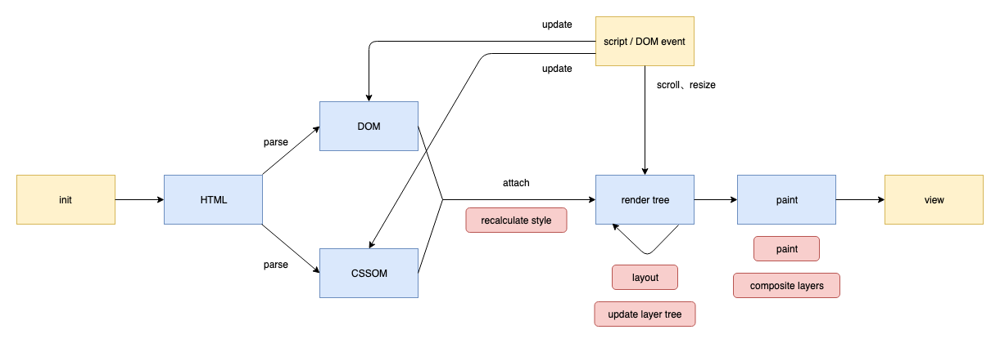

# 浏览器渲染

浏览器因内核不同对渲染的实现会略有差异，这里以chrome(74)为例。

## 渲染步骤

渲染的几个关键步骤

1. recalculate style (style)：结合DOM和CSSOM，确定各元素应用的CSS规则
2. layout：重新计算各元素位置来布局页面，也称reflow
3. update layer tree (layer)：更新渲染树
4. paint：绘制各个图层
5. composite layers (composite)：把各个图层合成为完整页面

渲染过程中，layout可能被跳过，比如对样式的修改不影响layout时，则只需repaint而不需reflow。可以借助 [CSS Triggers](https://csstriggers.com/) 查看哪些CSS属性会影响layout。paint也可能被跳过，比如只需重绘合成层的内容时。

## 渲染时机

当DOM或者CSSOM被修改，浏览器并不是立刻将改变渲染到屏幕上，而是把render flag标记为true。在**下一个渲染时机**如果判断此flag为true，就执行完整渲染过程，再重置render flag。

**渲染时机**一般是在下次屏幕刷新前。两次刷新间隔的时间为1帧，1帧的最小值一般为16.66ms左右，因硬件而异。渲染也会受主线程繁忙程度的影响，因为渲染线程和JS执行线程是互斥的，在JS执行线程结束前主线程不会去调起渲染线程。

但有时渲染过程中的recalculate style、layout会被**提前**，而不是等到达渲染时机再执行。比如修改了layout相关样式后，未到渲染时机就**对layout相关属性进行了读取**，则浏览器会立刻执行recalculate style和layout来返回准确的layout信息。

## 硬件加速

浏览器会按规则把页面分为多个图层。满足某些规则的节点会升级为合成层，交由GPU绘制，即硬件加速。最终呈现的页面是多个图层复合的结果。合成层上的某些样式变动只需重绘这个层，再把各层重新复合即可。

节点升级为合成层的情况有：

- transform
- opacity
- will-change
- canvas元素
- 有比自己index低的合成层
- etc.

使用合成层能提高页面动画性能，但其创建需要额外开销，应结合实际需要合理利用。

## 结合例子

创建一个div为例子，在body的click事件对div进行修改

    // 创建测试div
    const div = document.createElement('div');
    div.style.cssText = 'width: 100px; height: 100px; background: red';
    document.body.appendChild(div);

    // 对div样式进行修改
    document.body.addEventListener('click', () => {
      // ...
    });

在click回调中，分别采用如下代码来测试，用chrome的performance工具分析结果。一个task条表示一轮事件循环，一个frame条表示实际一帧图像的持续时间。

### 1、单次渲染

    document.body.addEventListener('click', () => {
      div.style.height = '110px'; // step 1
    });

  

  一个基本的渲染例子，`step 1`之后浏览器执行了完整的5个渲染步骤。

### 2、多轮task下的渲染

    document.body.addEventListener('click', () => {
      div.style.height = '110px'; // step 1
      setTimeout(() => {
        div.style.height = '120px'; // step 2
        setTimeout(() => {
          div.style.height = '130px'; // step 3
        });
      });
    });

同例子1，`step 1`之后，浏览器同样执行了完整的5个渲染步骤。

但`step 2`执行后并没有渲染，直到`step 3`执行后的一段时间才渲染，因为这时才到达渲染时机。

从frames栏看到，从`step 2`执行到`step 3`执行到再次渲染的这14.0ms期间，页面上显示的一直是110px的div，执行完第二次渲染后，直接变为130px的div。

### 3、提前读取layout相关属性

    document.body.addEventListener('click', () => {
      div.style.height = '110px'; // step 1
      console.log(div.offsetHeight);
      setTimeout(() => {
        div.style.height = '120px'; // step 2
        console.log(div.offsetHeight);
        setTimeout(() => {
          div.style.height = '130px'; // step 3
          console.log(div.offsetHeight);
        });
      });
    });

对例子2稍加改动，在每个step后面都加上了对layout属性的读取。

结果是每次读取时，如果render flag为true，浏览器都会立刻强制执行style和layout来保证返回正确的数据。但仅提前了这2个步骤，后续步骤不变。

### 4、仅修改非layout相关属性

    document.body.addEventListener('click', () => {
      div.style.background = '#123'; // step 1
      setTimeout(() => {
        div.style.background = '#456'; // step 2
        setTimeout(() => {
          div.style.background = '#789'; // step 3
        });
      });
    });

把例子2中对div的height属性改动变成对background属性（非layout相关属性）改动。

结果渲染过程跳过了layout这一步。

### 5、使用合成层

    document.body.addEventListener('click', () => {
      div.style.transform = 'scaleY(1.1)'; // step 1
      setTimeout(() => {
        div.style.transform = 'scaleY(1.2)';  // step 2
        setTimeout(() => {
          div.style.transform = 'scaleY(1.3)';  // step 3
        });
      });
    });

把例子2中对div的height属性改动变成对tansform属性（合成层属性）改动。

执行`step 1`后，第一次渲染依然是5步完整的渲染步骤，因为此前div没有transform属性，还处于大图层中，这次渲染后才把div提升为合成层。

第二次渲染时，div已经是合成层，对合成层的transform改动不会影响其他图层，渲染过程跳过了layout和paint。

### 6、使用requestAnimationFrame控制时机

    document.body.addEventListener('click', () => {
      div.style.height = '110px'; // step 1
      requestAnimationFrame(() => {
        div.style.height = '120px'; // step 2
        requestAnimationFrame(() => {
          div.style.height = '130px'; // step 3
        });
      });
    });

把例子2中各step的执行时机从setTimeout回调改为requestAnimationFrame（以下简称rAF）回调。rAF回调中的任务会在下个渲染时机执行。

`step 1`执行完后到达第一个渲染时机时，浏览器先执行了style & layout，接着不是执行layer，而是执行rAF任务（执行`step 2`并新增一个rAF任务），再重新进行渲染。然后是等到第二个渲染时机，执行第二个rAF任务（执行`step 3`），再进行渲染。

使用rAF替代定时器来实现动画，能保证rAF任务中的改动结果一定会被渲染，因为rAF任务的执行和渲染的频率是同步的，不会像例子2中`step 2`的改动被忽略，从而有更流畅的动画表现。当然这里讨论的是用JS去改样式，如果能直接用CSS的animation替代效果更佳。

### 7、阻塞渲染

    document.body.addEventListener('click', () => {
      div.style.height = '110px'; // step 1
      let i = 0;
      while (i++ < 100000000) {}
    });

一轮task中如果进行了长耗时的计算，浏览器会一直等到计算完成才执行渲染，这会导致一帧图像持续的时间过长，也就是页面卡顿现象。

可以通过把任务拆分到多个task分段执行，或放到web worker执行来解决。

## 小结

- 避免频繁对layout相关属性的读取。
- 可以的话，样式需求优先用非layout相关属性去实现。
- 持续修改样式来实现动画时，使用requestAnimationFrame来替代定时器。
- 合理利用合成层（优先用transform实现动画；在合理时机设置节点的will-change；合成层的index尽可能调高，避免上层创建不必要的合成层）。
- 耗时较长的任务尽量拆分到多个task中分段执行，或放到web worker执行。

