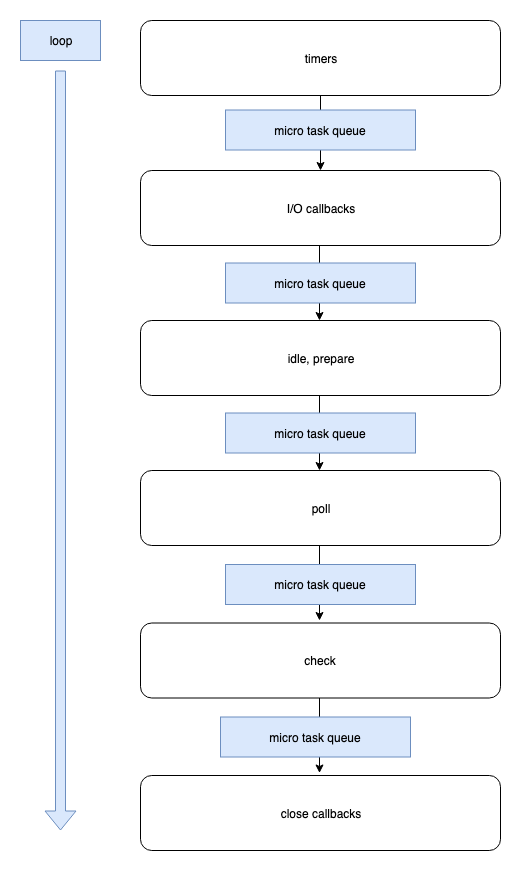

# 事件循环

## NodeJS的事件循环

和[【事件循环（浏览器）】](/js/thread?id=事件循环)略有不同，NodeJS中的事件循环把一次循环分为多个阶段，基于libuv库实现

- timers：这个阶段执行timer（setTimeout、setInterval）的回调
- I/O callbacks：执行上轮poll阶段遗留的callback
- idle, prepare：仅node内部使用
- poll：先执行poll队列的callback（I/O事件的回调）；有到期timer跳转timers阶段，有setImmediate跳转check阶段，两者都无时node可能会在此阶段轮询来等待I/O事件返回
- check：执行 setImmediate() 的回调
- close callbacks：执行 socket 的 close 事件回调

这里**每个的阶段间隙都会检查并执行nexttick和microtask**



举个例子：

```js
setTimeout(() => {
  console.log('timeout 1');
  Promise.resolve().then(() => console.log('promise 1'));
});
setTimeout(() => {
  console.log('timeout 2');
  Promise.resolve().then(() => console.log('promise 2'));
});
```

以上例子在浏览器中运行结果：

timeout 1 / promise 1 / timeout 2 / promise 2，在node中运行结果：timeout 1 / timeout 2 / promise 1 / promise 2

node会在timers阶段统一检查当前是否有到期的定时器任务，有的话会把它们放在同一次task中执行，并在task间隙执行清空microtask。


