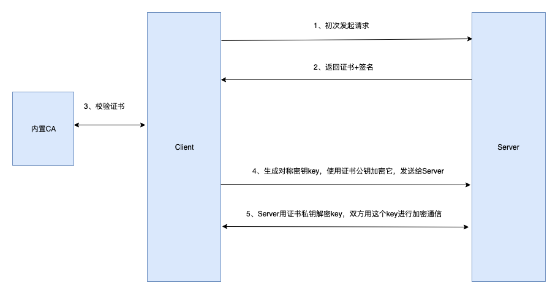

# 协议

## HTTP

基于tcp协议，req格式： `HTTP/1.1 /index.html GET\r\nConnection: keep-alive`，res格式：`HTTP/1.1 200 OK\r\nContent-type: text/plain\r\n\r\nsome text here`

1.1默认keep-alive，基于一次tcp（3次握手4次挥手）来发多次http请求

状态码12345

header(content-type/accept-encoding/user-agent/cookie/access-control-allow-origin/cache-control/e-tag/connection)

缓存控制

cookie

### code in HTTP header or body

可以类比TCP/QUIC，在 直接利用现有协议/在协议下层自定义封装 之间的取舍。

## TCP/UDP

都基于IP的传输层协议，传输数据给应用层协议使用。

因为两者都基于网络层的IP协议，都可能会出现丢包或乱序。而TCP与UDP不同的是，它在协议层封装了滑动窗口（超时重传来控制顺序、控制并发数来合理利用带宽）来解决这些问题。基于UDP也同样可以在应用层自行封装实现TCP的功能，比如谷歌的QUIC。

### QUIC

## HTTPS

HTTP是明文传输，且没有对来源校验，通信内容易受中间人的监视和篡改。所以需要对通信内容加密来解决问题，其中最关键的是保证密钥的正确和安全。

HTTPS引入了CA来解决问题，CA是一个权威机构，负责给受信的网站颁发证书，证书包含一对公私钥，私钥由网站保管，公钥对外公开。现代浏览器会内置CA的公共信息。

HTTP：IP -> TCP -> HTTP

HTTPS: IP -> TCP -> **SSL/TLS** -> HTTP

> 公钥私钥涉及非对称加密的知识，相关内容详见[【内容加密】](/web/safe?id=内容加密)

HTTPS通信过程如下：

1. Client发起请求

2. Server收到请求，返回明文证书内容（包含网站信息、签发机构CA信息、证书有效期等）和证书签名（对**证书内容hash**用CA私钥加密后得到的签名）

3. Client收到证书后，从**内置的CA证书表**中，取出和Server证书对应的CA公钥，解密签名，将签名数据与证书内容比对，若一致，则说明此签名一定是CA私钥持有方签发的，即可认为此证书来源可信（这步的关键之处在于CA公钥是从本地直接取得的，保证公钥绝对可信）

4. Client**生成对称密钥key**，将key用CA公钥加密后发给Server，这个加密能确保没有CA私钥的人无法拿到key

5. Server收到加密内容后，用CA私钥解密出key，之后双方即可用这个key来进行加密通信

## HTTP2

相比HTTP的改进点：

1. 编码方式：文本 => 二进制
2. 多路复用：一个tcp连接中同时发起多个http请求，而不是一个http请求完毕才能发下一个
3. 头部压缩：客户端/服务端都维护一个headers索引表，请求不再每次都带上完整headers
4. 主动推送：可以在客户端请求html时，把相关css、js也一并推送（需要服务端配置）

区分HTTP：

HTTP2的headers风格是（冒号+）全小写+连字符，比如`:method`、`user-agent`等，HTTP1的风格是首字母大写+连字符。

HTTP2必须基于HTTPS，虽然HTTP2协议本身并不要求HTTPS，但各浏览器的实现都要求HTTP2必须用HTTPS。

## websocket

和http一样基于tcp，http协议的升级

tcp连接（连接实例称为socket）建立后，客户端发送http格式的报文`{ Connection: Upgrade, Upgrade: websocket, ... }`，服务端如果支持，也返回类似的确认报文，双方都对这个socket做好全双工通信的准备，即websocket连接建立。

### socket

套接字，可以理解为一个连接的实例，
比如说服务端客户端建立起一个tcp连接，那么两端各会有一个socket实例，可以对其调用各种方法来收发信息。

## 七层模型

应用：http

会话：ssl/tls

传输：tcp/udp

网络：ip

